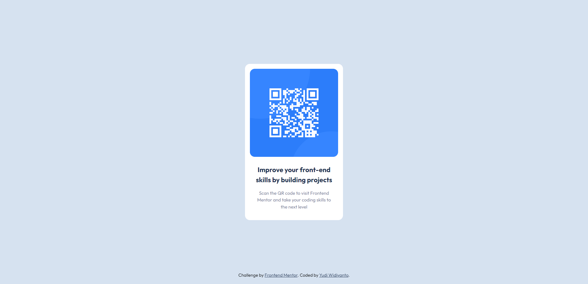

# Frontend Mentor - QR code component solution

This is a solution to the [QR code component challenge on Frontend Mentor](https://www.frontendmentor.io/challenges/qr-code-component-iux_sIO_H).

## Screenshot

## Links

- Solution URL: [Solution](https://www.frontendmentor.io/solutions/qr-code-component-eaogT0735W)
- Live Site URL: [Demo site](https://yudiwdynto.github.io/qr-code-component/)
